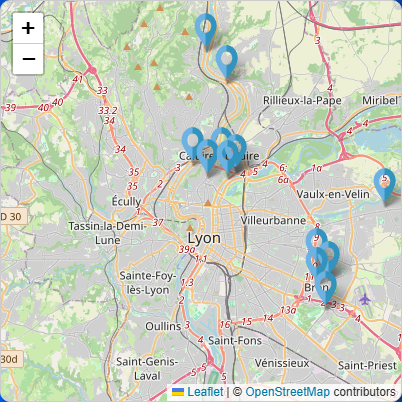
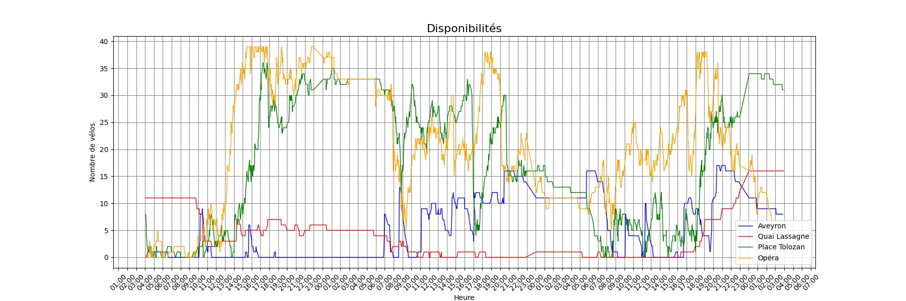

# Map-Vélov — Lyon Bike-Sharing Interactive Map



A full-stack web application that displays availability of **Vélov** (Lyon) bike-sharing stations on an interactive map, with historical data visualization.

Developed as a team project for the **INF-TC3** course at **Centrale Lyon** (2023–2024).

## Features

- **Interactive map** — Leaflet.js map showing Vélov stations across Lyon and surrounding communes; click to toggle station markers per commune
- **Station details** — click a marker to see station name; select stations to load historical charts
- **Historical charts** — visualize availability trends over time for any combination of stations (mechanical bikes, electric bikes, available stands)
- **Python backend** — lightweight HTTP server querying a local SQLite database of historical records



## Tech Stack

- **Backend** — Python (stdlib `http.server`, `sqlite3`, `matplotlib`)
- **Frontend** — HTML, CSS, JavaScript
- **Map** — Leaflet.js
- **Data** — SQLite database with historical Vélov station records

## Team

Gegout Carl-Henri · Tribout Rémy · Gros Maxime · Cres Raphaël · Marois Viki

## Running Locally

```bash
pip install -r requirements.txt
python serveur.py
```

Then open [http://localhost:8080/map-velov.html](http://localhost:8080/map-velov.html) in your browser.
